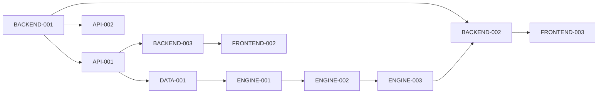

# Agent Delegation Plan

**Created**: 2025-11-23
**Author**: Technical Lead

## Overview

This document outlines the delegation of refined tasks to specialized agents for the Chess Pattern Analyzer MVP implementation.

## Required Agents

### 1. backend-developer
- **Status**: To be created
- **Purpose**: Python/FastAPI backend implementation
- **Proposal**: /home/gspadz/github/chess/docs/agent-proposals/backend-developer-agent.md

### 2. chess-engine-developer
- **Status**: To be created
- **Purpose**: Chess analysis engine implementation
- **Proposal**: /home/gspadz/github/chess/docs/agent-proposals/chess-engine-developer-agent.md

### 3. frontend-developer
- **Status**: To be created
- **Purpose**: Next.js frontend implementation
- **Proposal**: /home/gspadz/github/chess/docs/agent-proposals/frontend-developer-agent.md

## Task Assignments

### Phase 1: Foundation (Week 1)
| Task ID | Task Name | Status | Assigned To | Priority |
|---------|-----------|--------|-------------|----------|
| API-001 | Chess.com API Integration | `todo` | backend-developer | Critical |
| API-002 | Rate Limiting Infrastructure | `todo` | backend-developer | Critical |
| DATA-001 | Data Models and Storage | `todo` | backend-developer | High |
| BACKEND-001 | REST API Framework | `todo` | backend-developer | Critical |

### Phase 2: Analysis Engine (Weeks 2-3)
| Task ID | Task Name | Status | Assigned To | Priority |
|---------|-----------|--------|-------------|----------|
| ENGINE-001 | Pattern Detection Core | `todo` | chess-engine-developer | Critical |
| ENGINE-002 | Weakness Aggregation | `refinement-needed` | chess-engine-developer | Critical |
| ENGINE-003 | Recommendation Generator | `refinement-needed` | chess-engine-developer | High |

### Phase 3: Backend API (Weeks 3-4)
| Task ID | Task Name | Status | Assigned To | Priority |
|---------|-----------|--------|-------------|----------|
| BACKEND-002 | Analysis Endpoint | `refinement-needed` | backend-developer | Critical |
| BACKEND-003 | Username Validation | `refinement-needed` | backend-developer | High |

### Phase 4: Frontend (Weeks 4-5)
| Task ID | Task Name | Status | Assigned To | Priority |
|---------|-----------|--------|-------------|----------|
| FRONTEND-001 | React App Setup | `refinement-needed` | frontend-developer | Critical |
| FRONTEND-002 | Username Input Flow | `refinement-needed` | frontend-developer | Critical |
| FRONTEND-003 | Analysis Dashboard | `refinement-needed` | frontend-developer | Critical |
| FRONTEND-004 | Game Example Viewer | `refinement-needed` | frontend-developer | High |
| FRONTEND-005 | Recommendations Display | `refinement-needed` | frontend-developer | High |

## Execution Order

### Week 1 - Foundation Sprint
1. **backend-developer** starts immediately with:
   - BACKEND-001: Set up FastAPI framework (Day 1)
   - API-001 & API-002: Parallel implementation (Days 2-3)
   - DATA-001: Data models (Day 4)

### Week 2 - Analysis Engine Sprint
2. **chess-engine-developer** begins with:
   - ENGINE-001: Pattern detection core (Days 1-4)
   - Note: ENGINE-002 and ENGINE-003 need refinement first

### Week 3 - Integration Sprint
3. **backend-developer** continues with:
   - BACKEND-002: Analysis endpoint (after ENGINE-001)
   - BACKEND-003: Username validation

### Week 4-5 - Frontend Sprint
4. **frontend-developer** implements:
   - FRONTEND-001 through FRONTEND-005 (sequential)

## Dependencies

## Instructions for Main Claude Agent

To begin implementation:

1. **Create the specialized agents** using the proposals in `/home/gspadz/github/chess/docs/agent-proposals/`

2. **Assign Phase 1 tasks to backend-developer**:
   - Start with BACKEND-001 (REST API Framework)
   - Then parallel work on API-001 and API-002
   - Follow with DATA-001

3. **Assign ENGINE-001 to chess-engine-developer** once created

4. **Monitor progress** and update task statuses in the implementation plan

5. **Refine remaining tasks** as agents complete their current work

## Communication Protocol

- Agents should update task status in implementation plan when starting/completing work
- Agents should create PR-ready code in appropriate directories
- Agents should document any blockers or clarification needs
- Technical lead will coordinate dependencies and resolve conflicts

## Success Criteria

- All Phase 1 tasks completed by end of Week 1
- Working API with rate limiting by Day 5
- Analysis engine processing games by Week 2
- Frontend showing analysis results by Week 5

## Next Steps for Technical Lead

1. Continue refining remaining `refinement-needed` tasks
2. Monitor agent progress on assigned tasks
3. Resolve any technical blockers
4. Ensure integration points are well-defined
5. Review and approve completed work