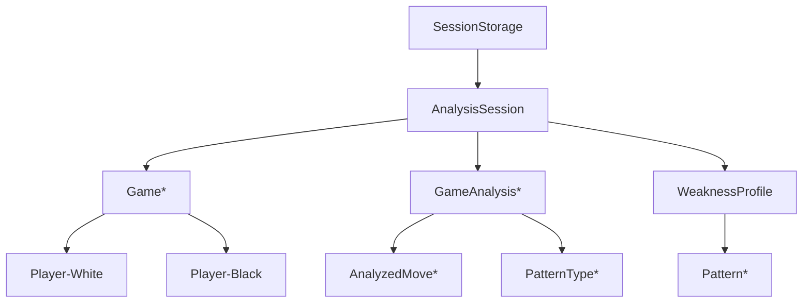

# Task: DATA-001 - Data Models and Storage

**Status**: `todo`
**Priority**: High
**Assigned Agent**: backend-developer
**Estimated Effort**: 1 day
**Dependencies**: API-001 (for Chess.com data structure)

## Objective

Define comprehensive data models using Pydantic for type safety and validation, covering game data, analysis results, and temporary storage strategies for the MVP phase without persistent database.

## Success Criteria

1. Complete Pydantic models for all data entities
2. Efficient in-memory storage for analysis sessions
3. JSON serialization/deserialization working correctly
4. Support for 100+ games per analysis session
5. Clear separation between raw data and analysis results
6. Memory usage under 100MB for typical analysis

## Technical Approach

### 1. Core Game Data Models

```python
from pydantic import BaseModel, Field, validator
from datetime import datetime
from typing import Optional, List, Dict, Any
from enum import Enum

class TimeControl(str, Enum):
    BULLET = "bullet"
    BLITZ = "blitz"
    RAPID = "rapid"
    CLASSICAL = "classical"
    CORRESPONDENCE = "correspondence"

    @classmethod
    def from_seconds(cls, seconds: int) -> 'TimeControl':
        """Classify time control from seconds"""
        if seconds < 180:
            return cls.BULLET
        elif seconds < 600:
            return cls.BLITZ
        elif seconds < 1800:
            return cls.RAPID
        elif seconds < 86400:
            return cls.CLASSICAL
        else:
            return cls.CORRESPONDENCE

class GameResult(str, Enum):
    WHITE_WIN = "1-0"
    BLACK_WIN = "0-1"
    DRAW = "1/2-1/2"
    IN_PROGRESS = "*"

class Player(BaseModel):
    username: str
    rating: int
    rating_diff: Optional[int] = None
    country: Optional[str] = None
    title: Optional[str] = None  # GM, IM, FM, etc.

    @validator('username')
    def username_lowercase(cls, v):
        return v.lower()

class Game(BaseModel):
    id: str  # Unique game identifier
    url: str  # Chess.com game URL
    pgn: str  # Full PGN text
    white: Player
    black: Player
    result: GameResult
    time_control: TimeControl
    time_class: str  # Original from API
    rated: bool
    rules: str = "chess"  # chess, chess960, etc.
    eco: Optional[str] = None  # Opening ECO code
    opening_name: Optional[str] = None
    fen: Optional[str] = None  # Final position
    start_time: datetime
    end_time: datetime
    termination: str  # checkmate, resignation, time, etc.

    class Config:
        json_encoders = {
            datetime: lambda v: v.isoformat()
        }

    @validator('pgn')
    def validate_pgn(cls, v):
        """Basic PGN validation"""
        if not v or len(v) < 10:
            raise ValueError("Invalid PGN data")
        return v

    def get_user_color(self, username: str) -> Optional[str]:
        """Determine if user played white or black"""
        username_lower = username.lower()
        if self.white.username == username_lower:
            return "white"
        elif self.black.username == username_lower:
            return "black"
        return None

    def get_user_result(self, username: str) -> Optional[str]:
        """Get result from user's perspective"""
        color = self.get_user_color(username)
        if not color:
            return None

        if self.result == GameResult.DRAW:
            return "draw"
        elif color == "white" and self.result == GameResult.WHITE_WIN:
            return "win"
        elif color == "black" and self.result == GameResult.BLACK_WIN:
            return "win"
        else:
            return "loss"
```

### 2. Analysis Data Models

```python
from typing import List, Dict, Any
from pydantic import BaseModel, Field
import uuid

class MoveClassification(str, Enum):
    BRILLIANT = "brilliant"
    GREAT = "great"
    BEST = "best"
    GOOD = "good"
    INACCURACY = "inaccuracy"
    MISTAKE = "mistake"
    BLUNDER = "blunder"
    MISSED_WIN = "missed_win"

class AnalyzedMove(BaseModel):
    move_number: int
    move: str  # UCI notation
    san: str  # Standard Algebraic Notation
    classification: MoveClassification
    eval_before: float  # Centipawns
    eval_after: float
    best_move: Optional[str] = None
    best_eval: Optional[float] = None
    time_spent: Optional[float] = None  # Seconds

    @property
    def eval_loss(self) -> float:
        """Calculate evaluation loss in centipawns"""
        if self.best_eval is not None:
            return abs(self.best_eval - self.eval_after)
        return 0

class PatternType(str, Enum):
    OPENING_MISTAKE = "opening_mistake"
    TACTICAL_MISS = "tactical_miss"
    POSITIONAL_ERROR = "positional_error"
    ENDGAME_MISTAKE = "endgame_mistake"
    TIME_TROUBLE = "time_trouble"
    HANGING_PIECE = "hanging_piece"
    FORK = "fork"
    PIN = "pin"
    SKEWER = "skewer"
    DISCOVERED_ATTACK = "discovered_attack"
    BACK_RANK_MATE = "back_rank_mate"

class Pattern(BaseModel):
    type: PatternType
    frequency: int
    severity: float  # 0-1 scale
    examples: List[Dict[str, Any]]  # Position examples
    description: str
    improvement_suggestion: str

class GameAnalysis(BaseModel):
    game_id: str
    analyzed_at: datetime
    white_accuracy: float  # 0-100
    black_accuracy: float
    opening_phase: Dict[str, Any]  # ECO, name, evaluation
    moves: List[AnalyzedMove]
    critical_moments: List[int]  # Move numbers
    turning_points: List[int]
    patterns_detected: List[PatternType]

    def get_user_accuracy(self, username: str, game: Game) -> float:
        """Get accuracy for specific user"""
        color = game.get_user_color(username)
        if color == "white":
            return self.white_accuracy
        elif color == "black":
            return self.black_accuracy
        return 0.0

    def get_user_mistakes(self, username: str, game: Game) -> List[AnalyzedMove]:
        """Get mistakes/blunders for specific user"""
        color = game.get_user_color(username)
        if not color:
            return []

        mistakes = []
        for i, move in enumerate(self.moves):
            # White moves on even indices, black on odd
            is_user_move = (color == "white" and i % 2 == 0) or \
                          (color == "black" and i % 2 == 1)

            if is_user_move and move.classification in [
                MoveClassification.MISTAKE,
                MoveClassification.BLUNDER,
                MoveClassification.MISSED_WIN
            ]:
                mistakes.append(move)

        return mistakes
```

### 3. Aggregated Analysis Models

```python
class WeaknessProfile(BaseModel):
    username: str
    games_analyzed: int
    date_range: Dict[str, datetime]
    overall_accuracy: float
    win_rate: float
    draw_rate: float
    loss_rate: float

    # Weakness patterns
    patterns: List[Pattern]

    # Phase-specific stats
    opening_accuracy: float
    middlegame_accuracy: float
    endgame_accuracy: float

    # Time management
    avg_time_per_move: float
    time_trouble_frequency: float

    # Tactical stats
    blunder_rate: float  # Blunders per game
    mistake_rate: float
    missed_wins: int

    # Opening repertoire
    opening_performance: Dict[str, Dict[str, float]]  # ECO -> stats

    # Recommendations
    top_weaknesses: List[str]
    improvement_plan: List[Dict[str, Any]]
    suggested_studies: List[str]

class AnalysisSession(BaseModel):
    id: str = Field(default_factory=lambda: str(uuid.uuid4()))
    username: str
    created_at: datetime = Field(default_factory=datetime.now)
    expires_at: datetime
    status: str  # pending, processing, completed, failed
    progress: float = 0.0  # 0-100

    # Input parameters
    date_range: Optional[Dict[str, datetime]] = None
    game_count: int = 50

    # Raw data
    games: List[Game] = []

    # Analysis results
    game_analyses: List[GameAnalysis] = []
    weakness_profile: Optional[WeaknessProfile] = None

    # Metadata
    processing_time: Optional[float] = None
    error_message: Optional[str] = None

    @property
    def is_expired(self) -> bool:
        return datetime.now() > self.expires_at

    def update_progress(self, current: int, total: int):
        """Update analysis progress"""
        self.progress = min(100, (current / total) * 100)
```

### 4. Temporary Storage Manager

```python
from typing import Optional, Dict
import asyncio
from datetime import timedelta

class SessionStorage:
    """In-memory storage for analysis sessions"""

    def __init__(self, ttl_hours: int = 24):
        self.sessions: Dict[str, AnalysisSession] = {}
        self.ttl = timedelta(hours=ttl_hours)
        self.lock = asyncio.Lock()
        self.max_sessions = 1000  # Prevent memory overflow

    async def create_session(self, username: str, game_count: int = 50) -> AnalysisSession:
        """Create new analysis session"""
        async with self.lock:
            # Clean expired sessions
            await self._cleanup_expired()

            # Check capacity
            if len(self.sessions) >= self.max_sessions:
                # Remove oldest session
                oldest_id = min(
                    self.sessions.keys(),
                    key=lambda k: self.sessions[k].created_at
                )
                del self.sessions[oldest_id]

            # Create new session
            session = AnalysisSession(
                username=username,
                game_count=game_count,
                expires_at=datetime.now() + self.ttl
            )

            self.sessions[session.id] = session
            return session

    async def get_session(self, session_id: str) -> Optional[AnalysisSession]:
        """Retrieve session by ID"""
        async with self.lock:
            session = self.sessions.get(session_id)
            if session and not session.is_expired:
                return session
            elif session and session.is_expired:
                del self.sessions[session_id]
            return None

    async def update_session(self, session: AnalysisSession) -> bool:
        """Update existing session"""
        async with self.lock:
            if session.id in self.sessions:
                self.sessions[session.id] = session
                return True
            return False

    async def delete_session(self, session_id: str) -> bool:
        """Delete session"""
        async with self.lock:
            if session_id in self.sessions:
                del self.sessions[session_id]
                return True
            return False

    async def _cleanup_expired(self):
        """Remove expired sessions"""
        now = datetime.now()
        expired_ids = [
            sid for sid, session in self.sessions.items()
            if session.expires_at < now
        ]
        for sid in expired_ids:
            del self.sessions[sid]

    def get_memory_usage(self) -> Dict[str, Any]:
        """Estimate memory usage"""
        import sys

        total_size = 0
        for session in self.sessions.values():
            # Rough estimation
            total_size += sys.getsizeof(session.json())

        return {
            "session_count": len(self.sessions),
            "estimated_mb": round(total_size / (1024 * 1024), 2),
            "max_sessions": self.max_sessions
        }
```

### 5. Cache Models for Chess.com Data

```python
class CachedPlayerProfile(BaseModel):
    username: str
    exists: bool
    fetched_at: datetime
    profile_data: Optional[Dict[str, Any]] = None

    @property
    def is_stale(self, hours: int = 24) -> bool:
        age = datetime.now() - self.fetched_at
        return age.total_seconds() > hours * 3600

class GameCache(BaseModel):
    """Cache for fetched games to avoid re-fetching"""
    username: str
    year: int
    month: int
    games: List[Game]
    fetched_at: datetime

    @property
    def cache_key(self) -> str:
        return f"{self.username}:{self.year}:{self.month:02d}"
```

## Implementation Steps

1. Create Pydantic models for game data
2. Create analysis result models
3. Implement weakness profile aggregation models
4. Build session storage manager
5. Add cache models for API data
6. Create serialization utilities
7. Implement memory management
8. Write validation tests
9. Create model factories for testing
10. Document model relationships

## Testing Requirements

### Unit Tests
- Validate all Pydantic models
- Test enum conversions
- Test datetime serialization
- Test memory limits in storage
- Test session expiration

### Integration Tests
- Test full analysis flow data models
- Test session persistence
- Test concurrent session access
- Memory usage under load
- Serialization round-trips

## Acceptance Criteria

- [ ] All models have proper validation
- [ ] JSON serialization works correctly
- [ ] Session storage handles 1000+ sessions
- [ ] Memory usage stays under 100MB typical
- [ ] Expired sessions auto-cleanup
- [ ] Type hints complete for all models
- [ ] 95% test coverage
- [ ] Documentation includes model diagrams

## Configuration

```python
# settings.py
class DataSettings(BaseSettings):
    session_ttl_hours: int = 24
    max_sessions: int = 1000
    cache_ttl_hours: int = 12
    max_games_per_analysis: int = 100

    class Config:
        env_prefix = "DATA_"
```

## Model Relationships



## Notes

- Models designed for easy transition to database storage post-MVP
- Pydantic v2 recommended for performance
- Consider implementing model versioning for future migrations
- Memory management critical for scale
- Cache models reduce API load significantly